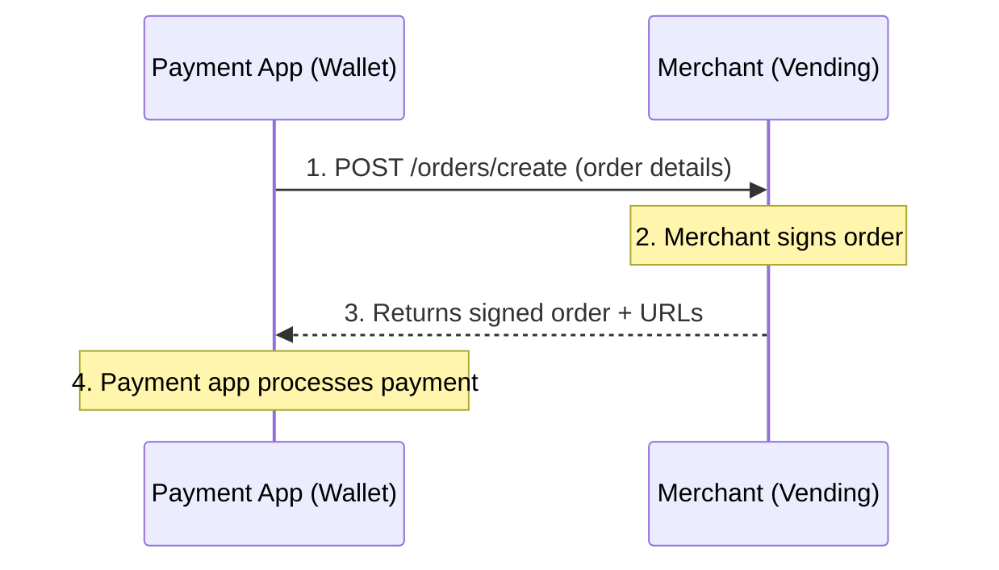
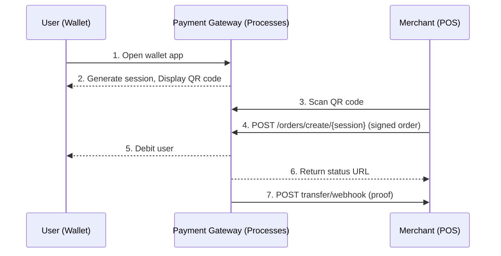
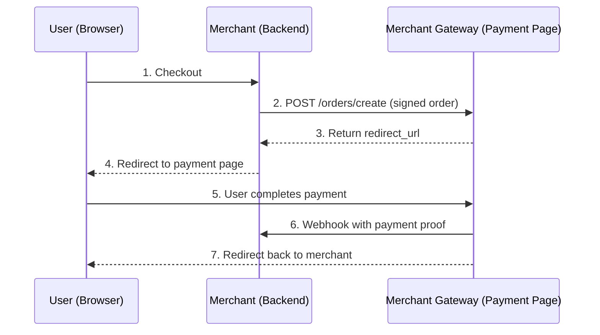

The `/orders/create` endpoint supports three integration patterns depending on who implements and calls it. This guide explains each pattern and when to use them.

## Integration Patterns

| Pattern | Implements | Called by | Response |
|---------|------------|-----------|----------|
| [Merchant](#merchant-flow) | Merchant | Payment App | Signed order + status URLs |
| [Payment Gateway](#payment-gateway-flow) | Payment Gateway | Merchant | Status URL |
| [Merchant Gateway](#merchant-gateway-flow) | Merchant Gateway | Merchant | Redirect URL |

## Merchant Flow

[Who is a merchant ? ](/guides/getting-started/developers#merchants)

Used for inventory-based payments such as vending machines, mobile top-up, or any scenario where the merchant controls the product catalog.



1. **User selects items** from the merchant's inventory
2. **Payment app** calls the merchant's `/orders/create` endpoint with order details
3. **Merchant** constructs the order, signs it with their private key, and returns it with status URLs
4. **Payment app** verifies the signature and processes the payment

### Use Cases

- Vending machines
- Mobile top-up kiosks
- In-store POS systems
- Any merchant with an inventory/catalog

### Implementation Notes

**For Merchants:**
- Sign every order with your private key
- Set `createdAt` timestamp when constructing the order
- Provide status URLs for payment apps to check order status

**For Payment Apps:**
- Verify the signature using the merchant's public key from their [metadata](/merchant-api/endpoint/metadata)
- Check `expiresAt` before processing
- Use the status URL to confirm payment or listen on [transfer/webhook](/merchant-api/endpoint/transfer-webhook)

## Payment Gateway Flow

[Who is a Payment Gateway ? ](/guides/getting-started/developers#payment-gateway)

Used when the gateway has the user's wallet information and the merchant initiates payment by scanning the user's QR code.



1. **User opens** their payment gateway app (wallet)
2. **Gateway generates** a temporary `sessionId` and displays a QR code
3. **Merchant scans** the QR code
4. **Merchant** constructs an order, signs it, and POSTs to the session endpoint
5. **Gateway** invalidates the session, retrieves the user, and processes the payment
6. **Gateway returns** a status URL the merchant can poll
7. **Gateway sends** a signed transfer proof to the merchant's webhook

### QR Code Format

The QR code should contain:

```
{gateway-endpoint}/opencharge/orders/create/{sessionId}
```

<Warning>
The URL path must follow the OpenCharge spec format. Some merchants validate that the endpoint URL matches the expected pattern before posting orders.
</Warning>

Include the gateway's OCID in the QR payload so merchants can fetch the gateway's metadata and verify the endpoint.

### Session ID

The `sessionId` is a temporary identifier that:

- **Protects user privacy** - avoids exposing user IDs in URLs
- **Enables URL reuse** - the same base endpoint works for all users
- **Is single-use** - invalidated after receiving an order
- **Has expiration** - should expire after a reasonable timeout (e.g., 5 minutes)

### Implementation Notes

**For Payment Gateways:**
- Generate cryptographically secure session IDs
- Invalidate sessions immediately upon use to prevent replay
- Verify merchant signature using their public key
- Send signed proof to merchant's transfer/webhook endpoint

**For Merchants:**
- Validate QR code URL matches expected OpenCharge pattern
- Fetch gateway metadata to verify OCID
- Sign the order before posting
- Listen on transfer/webhook for payment confirmation (more reliable than polling)

## Merchant Gateway Flow

[Who is a Merchant Gateway? ](/guides/getting-started/developers#merchant-gateway)

Used for web-based checkout where the merchant redirects users to a hosted payment page.



1. **User initiates checkout** on the merchant's website
2. **Merchant backend** creates an order, signs it, and POSTs to their merchant gateway
3. **Gateway returns** a `redirect_url` to their hosted payment page
4. **Merchant redirects** the user's browser to the payment page
5. **User completes payment** on the gateway's hosted page
6. **Gateway sends** a signed payment proof to the merchant's webhook
7. **Gateway redirects** the user back to the merchant's site

### Use Cases

- E-commerce checkout
- Subscription billing
- Multi-payment method support (gateway handles payment method selection)

### Implementation Notes

**For Merchant Gateways:**
- Validate the merchant's signature
- Store the order for display on the payment page
- Generate unique, expiring redirect URLs
- Send signed proof to merchant's transfer/webhook on completion

**For Merchants:**
- Always sign orders before submitting
- Implement [transfer/webhook](/merchant-api/endpoint/transfer-webhook) for reliable payment confirmation
- Don't trust user redirects alone - wait for webhook confirmation

<Warning>
Do not rely solely on the user returning to your site as confirmation of payment. Users may close their browser or encounter network issues. Always verify via webhook.
</Warning>

## Order Signing

In all patterns, orders are signed by the **merchant** using their private key. The signature covers the canonicalized JSON of the order object.

This ensures:
- **Authenticity** - The order was created by the claimed merchant
- **Integrity** - The order details haven't been tampered with
- **Non-repudiation** - The merchant cannot deny creating the order

Payment apps and gateways verify signatures using the merchant's public key from their [metadata](/merchant-api/endpoint/metadata).

## Choosing a Pattern

**Use the Merchant pattern when:**
- You have an inventory or catalog
- Payment apps need to fetch and pay for specific items
- You control what products/services are available

**Use the Payment Gateway pattern when:**
- You process payments for users who present QR codes
- Merchants scan user wallets to initiate payments
- You need session-based payment flows

**Use the Merchant Gateway pattern when:**
- You provide hosted checkout pages for merchants
- Merchants want to redirect users to complete payments
- You handle the payment UI on behalf of merchants
