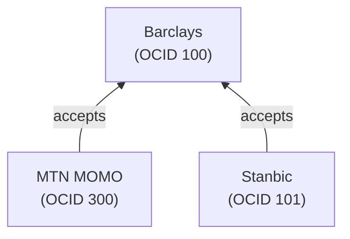

## Abstract

Opencharge is a decentralized protocol for payment service interoperability and verifiable settlement. It enables any payment service to authenticate requests and provide cryptographic proof of completed transfers—creating a trust network where signed receipts flow between parties to complete cross-platform payments.

**Core Principles:**

- **One identity, everywhere**: Register once, authenticate with any service
- **Signed receipts**: Every transfer produces a verifiable proof
- **Trust networks**: Services declare who they accept settlement from
- **Private rails**: Like blockchain transactions, but without the public ledger

---

## The Problem

A PayPal user in the US wants to pay a Mobile Money merchant in Uganda.

**Today's reality:**

- PayPal has no MTN MOMO integration
- MTN doesn't trust PayPal's internal records
- Building this corridor takes months of bilateral negotiation
- Each new corridor requires custom integration work

**With Opencharge:**

- PayPal checks MTN's metadata: "Who do you accept settlement from?"
- MTN accepts settlement from Barclays Bank Uganda
- PayPal has reserves at Barclays
- PayPal instructs Barclays to pay MTN → receives signed proof
- PayPal presents proof to MTN → MTN verifies Barclays' signature
- MTN credits merchant → transaction complete

## Key Insight: Signed Receipts

Every completed transfer produces a **signed transaction proof**. This proof:

- Is signed by the service that executed the transfer
- Can be verified by anyone with the signer's public key
- Serves as portable evidence of payment
- Functions like a blockchain transaction receipt, but private

## Trust Networks

Services explicitly declare which other services they trust for settlement. This creates a directed graph of trust relationships:

**Important**: Accepting settlement from an OCID implies you already have a working relationship with that entity. The protocol only facilitates verification, not trust establishment.

## Terminology

| Term                  | Definition                                                                 |
| --------------------- | -------------------------------------------------------------------------- |
| **OCID**              | Opencharge ID - a unique identifier (NFT token ID) for a service           |
| **Router Registry**   | Smart contract mapping OCIDs to metadata URLs                              |
| **Metadata**          | JSON document containing public key, endpoints, and settlement preferences |
| **Transaction Proof** | Signed receipt attesting that a transfer was completed                     |
| **Settlement**        | The process of presenting proof to satisfy a payment obligation            |

---

## Table of Contents

This specification is organized into the following sections:

1. [Protocol Overview](/guides/protocol/protocol-overview) - Introduction and core concepts
2. [Router Registry](/guides/protocol/router-registry) - Identity system and metadata schema
3. [Request Authentication](/guides/protocol/request-authentication) - Signatures and HTTP API
4. [Transaction Proofs](/guides/protocol/transaction-proofs) - Proof structure and verification
5. [API Reference](/merchant-api/introduction) - Standard endpoint reference
6. [Settlement Flow](/guides/protocol/settlement-flow) - Complete payment example
7. [Error Codes](/guides/protocol/error-codes) - Error handling reference
8. [Security](/guides/protocol/security) - Security considerations
9. [FAQ](/guides/protocol/faq) - Frequently asked questions
10. [Implementation Guide](/guides/protocol/implementation-guide) - Checklists and reference code
