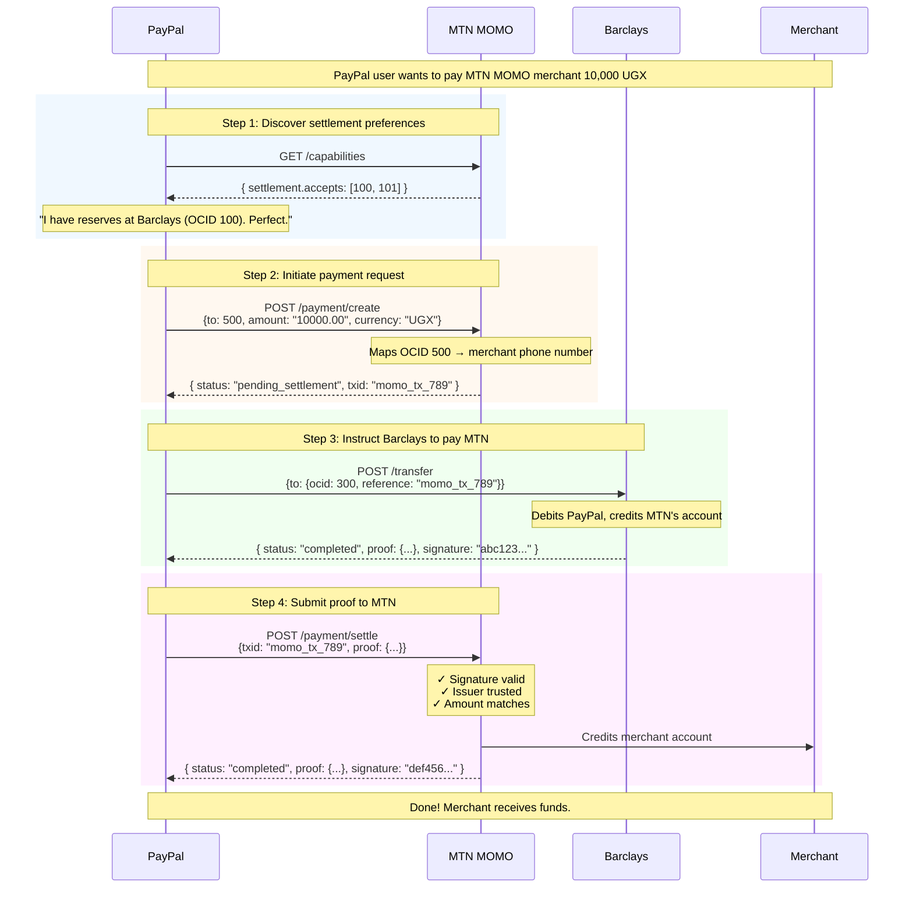

## Complete Example: PayPal → MTN MOMO

**What each party holds:**

| Party | Proofs Held |
|-------|-------------|
| PayPal | Barclays proof (sent to MTN) + MTN proof (confirmation) |
| MTN | Barclays proof (internal audit) + own proof (issued to merchant) |
| Merchant | MTN proof (confirmation of receipt) |
| Barclays | Internal records + proof issued to PayPal |