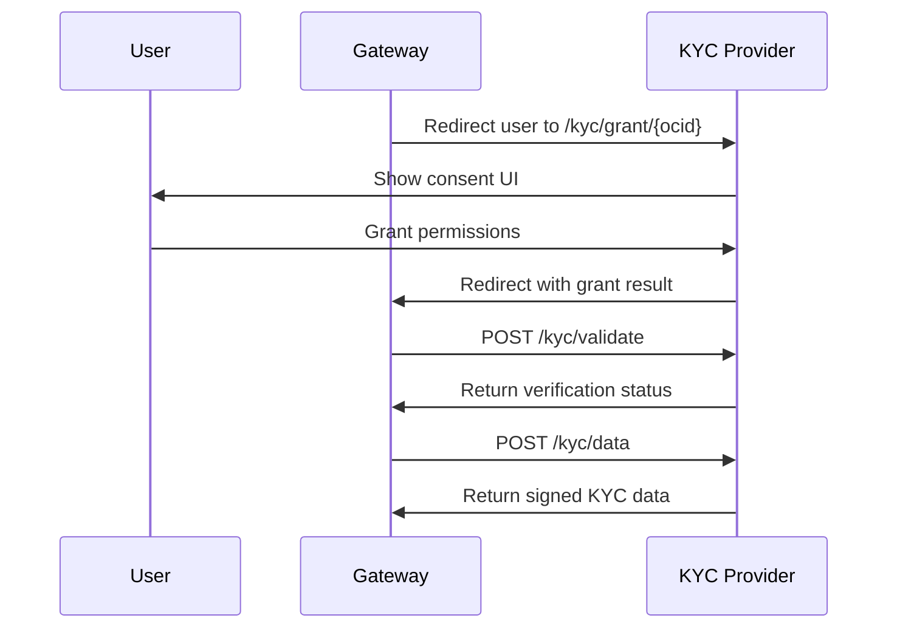

KYC Providers collect, verify, and share user identity information with authorized Opencharge Network entities. This API enables:

- **User consent** - Granular permission grants for sharing KYC data
- **Verification status** - Check what KYC items a user has verified
- **Secure data sharing** - Signed KYC data that can be cryptographically verified

## How It Works

## Grant Types

KYC providers support granular permissions that users can individually grant or deny:

| Grant | Description |
|-------|-------------|
| `name` | Full legal name |
| `email` | Email address |
| `phone` | Phone number |
| `date_of_birth` | Date of birth |
| `nationality` | Country of citizenship |
| `address` | Physical address |
| `id_card` | Government-issued ID card |
| `passport` | Passport document |
| `driver_license` | Driver's license |
| `proof_of_address` | Utility bill, bank statement |
| `liveness` | Selfie/liveness verification |
| `aml` | AML screening result |

## Verification Statuses

When checking KYC status via `/kyc/validate`, each item returns one of:

| Status | Meaning |
|--------|---------|
| `verified` | User provided and KYC provider verified this item |
| `pending` | Verification in progress |
| `missing` | User has not provided this item |
| `restricted` | User denied permission for this item |

## Endpoints

| Endpoint | Method | Description |
|----------|--------|-------------|
| `/metadata.json` | GET | Public metadata for service discovery |
| `/capabilities` | GET | Partner-specific capabilities |
| `/kyc/grant/{ocid}` | GET | UI for users to grant KYC access |
| `/kyc/validate` | POST | Check user's KYC status |
| `/kyc/data` | POST | Retrieve signed KYC data |

## Security

All KYC data responses are signed by the provider's private key. Recipients can verify the signature using the provider's public key from `/metadata.json`. This ensures data integrity and proves the KYC provider attested to the information.

Document images are served via secure, time-limited URLs that expire shortly after issuance.
