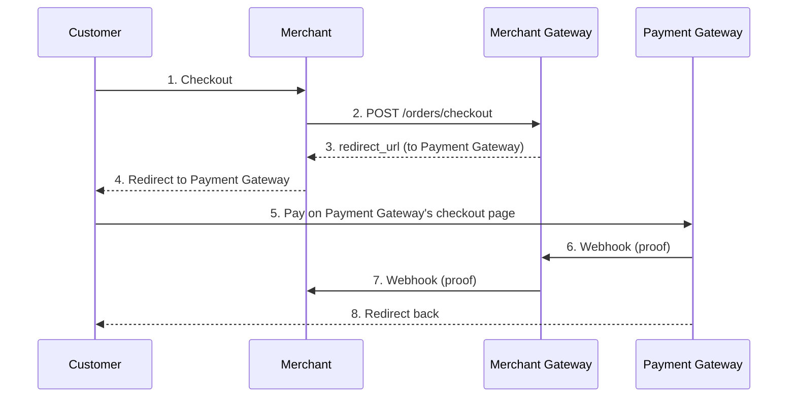

## Overview

A Merchant Gateway onboards merchants and helps them receive payments through the Opencharge network. You receive orders from merchants, coordinate with Payment Gateways (which handle end-user payments), and process settlements back to merchants.

<Card
  title="OpenAPI Specification"
  icon="code"
  href="https://github.com/opencharge/docs/blob/main/merchant-gateway-api/openapi.json"
>
  View the complete Merchant Gateway OpenAPI specification
</Card>

## What You Build

As a merchant gateway, you provide:

1. **Merchant onboarding** - Register and verify merchants on your platform
2. **Order routing** - Receive orders and return redirect URLs to Payment Gateways
3. **Settlement processing** - Receive payment proofs and settle funds to merchants
4. **Webhook notifications** - Informing merchants when payments complete

## Base URL

Host your API at the endpoint you register in the Router Registry:

```
https://pay.yourgateway.com/opencharge
```

## Endpoints you implement on your server

| Endpoint | Method | Description |
| -------- | ------ | ----------- |
| `/metadata.json` | GET | Your gateway's public metadata |
| `/capabilities` | GET | Partner-specific capabilities |
| `/orders/checkout` | POST | Receive orders from merchants, return redirect URL |
| `/transfer/create` | POST | Process internal and 3rd party transfers |
| `/transfer/webhook` | POST | Receive payment proofs from settlement providers |
| `/payment/create` | POST | Accept payment requests from 3rd party apps |
| `/payment/settle` | POST | Complete payments with settlement proofs |
| `/verify/{txid}` | GET | Verify transaction status |

## Flow

The Merchant Gateway sits between merchants and Payment Gateways. When a merchant receives an order, you route it to a Payment Gateway that handles the actual payment UI.



## Authentication

Verify merchant requests using these headers:

| Header           | Description                          |
| ---------------- | ------------------------------------ |
| `X-OC-ID`        | Merchant's OCID                      |
| `X-OC-Timestamp` | Unix timestamp in seconds            |
| `X-OC-Nonce`     | Unique request identifier            |
| `X-OC-Signature` | Signature of canonical request       |

Verify signatures using the merchant's public key from their `/metadata.json`.

## Order Verification

When you receive an order at `/orders/checkout`:

1. **Verify the merchant signature** on the order
2. **Check the merchant is registered** with your gateway
3. **Validate order details** (amount, currency, expiration)
4. **Select a Payment Gateway** to handle the payment
5. **Return the redirect URL** to the Payment Gateway's checkout page

```javascript
app.post('/orders/checkout', async (req, res) => {
  const { order, signature, urls } = req.body;
  const merchantOcid = req.headers['x-oc-id'];

  // 1. Verify merchant signature
  const publicKey = await getMerchantPublicKey(merchantOcid);
  if (!verifyOrderSignature(order, signature, publicKey)) {
    return res.status(400).json({
      error: { code: 'INVALID_SIGNATURE', message: 'Order signature invalid' }
    });
  }

  // 2. Check merchant is registered
  if (!isMerchantRegistered(merchantOcid)) {
    return res.status(401).json({
      error: { code: 'MERCHANT_NOT_REGISTERED', message: 'Unknown merchant' }
    });
  }

  // 3. Create session and forward to a Payment Gateway
  const session = await createSession(order, urls, merchantOcid);
  const paymentGateway = await selectPaymentGateway(order);
  const checkoutUrl = await forwardToPaymentGateway(paymentGateway, session);

  // 4. Return redirect URL to Payment Gateway's checkout page
  res.json({
    redirect_url: checkoutUrl
  });
});
```

## Receiving Payment Proofs

When a Payment Gateway completes a payment, it sends a proof to your `/transfer/webhook`. You then forward this proof to the merchant.

## Notifying Merchants

After receiving a payment proof, send a signed proof to the merchant's `/transfer/webhook`:

```javascript
async function notifyMerchant(session, proof) {
  const merchantEndpoint = await getMerchantEndpoint(session.merchantOcid);

  await fetch(`${merchantEndpoint}/transfer/webhook`, {
    method: 'POST',
    headers: {
      'Content-Type': 'application/json',
      ...createAuthHeaders(YOUR_OCID, YOUR_PRIVATE_KEY)
    },
    body: JSON.stringify({
      proof: {
        txid: proof.txid,
        issuer: YOUR_OCID,
        from: { ocid: session.customerOcid, reference: proof.txid },
        to: { ocid: session.merchantOcid, reference: session.order.id },
        amount: session.order.amount,
        currency: session.order.currency,
        timestamp: Math.floor(Date.now() / 1000),
        memo: `Payment for ${session.order.id}`
      },
      signature: signProof(proof, YOUR_PRIVATE_KEY)
    })
  });
}
```

## Settlement

As a Merchant Gateway, you sit between Payment Gateways and merchants. You must be able to settle proofs you receive.

When you receive a proof from a Payment Gateway:
- Verify the proof is valid and signed by a trusted Payment Gateway
- Forward the proof (or create your own proof) to the merchant
- Ensure the merchant trusts you as a settlement provider (your OCID is in their `accepts` array)

```javascript
// When receiving a proof from a Payment Gateway
app.post('/transfer/webhook', async (req, res) => {
  const { proof, signature } = req.body;
  const paymentGatewayOcid = req.headers['x-oc-id'];

  // Verify the Payment Gateway's signature
  if (!verifyProof(proof, signature, paymentGatewayOcid)) {
    return res.status(400).json({ error: { code: 'INVALID_PROOF' } });
  }

  // Forward to merchant (if merchant trusts us)
  await notifyMerchant(proof);

  res.json({ status: 'accepted' });
});
```

## Error Handling

Return errors in this format:

```json
{
  "error": {
    "code": "MERCHANT_NOT_REGISTERED",
    "message": "Merchant OCID 500 is not registered with this gateway"
  }
}
```

See [Error Codes](/guides/protocol/error-codes) for the complete list.
