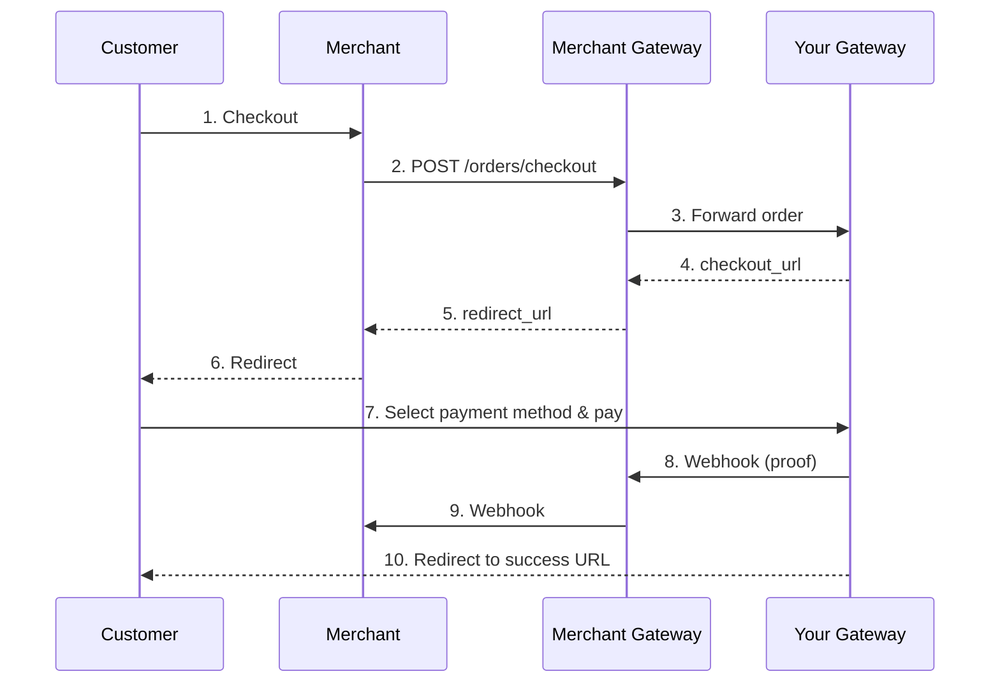
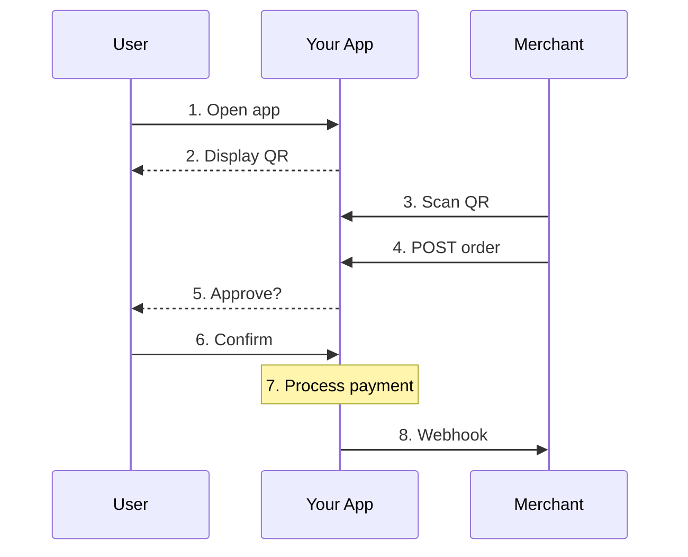
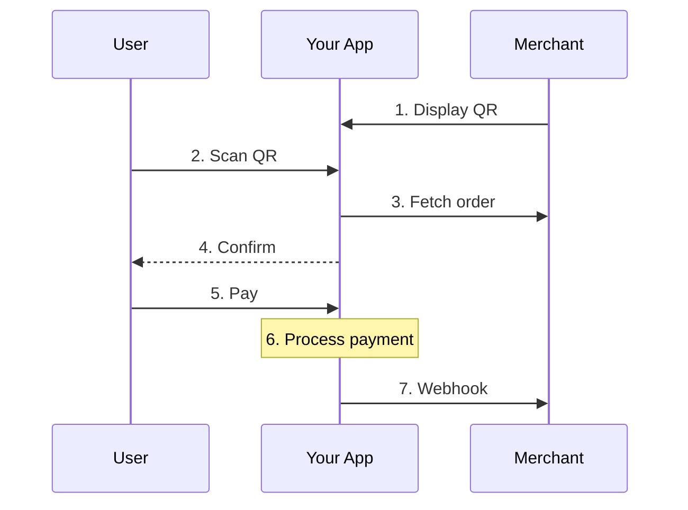

## Overview

A Payment Gateway helps end users pay merchants. This includes wallet apps where users scan QR codes, as well as hosted checkout pages where users are redirected to complete purchases. Your users don't need their own OCID - they use your service to make payments.

<Card
  title="OpenAPI Specification"
  icon="code"
  href="https://github.com/opencharge/docs/blob/main/payment-gateway-api/openapi.json"
>
  View the complete Payment Gateway OpenAPI specification
</Card>

## What You Build

As a payment gateway, you provide:

1. **Payment UI** - Hosted checkout pages or mobile wallet apps
2. **User management** - Maintain wallets or payment methods for your users
3. **Payment flows** - QR code scanning, checkout redirects, or both
4. **Settlement** - Send payment proofs to merchants or Merchant Gateways

## Base URL

Host your API at the endpoint you register in the Router Registry:

```
https://api.yourwallet.com/opencharge
```

## Endpoints

| Endpoint | Method | Description |
| -------- | ------ | ----------- |
| `/metadata.json` | GET | Your gateway's public metadata |
| `/capabilities` | GET | Partner-specific capabilities |
| `/checkout/create` | POST | Create hosted checkout session |
| `/orders/create/{sessionId}` | POST | Receive orders from merchants (QR flow) |
| `/transfer/create` | POST | Process transfers |
| `/transfer/webhook` | POST | Receive transfer notifications |

## Payment Flows

### 1. Hosted Checkout (Web Redirect)

Merchant Gateway sends an order to you. End user is redirected to your checkout page to complete payment.



### 3. Customer Displays QR (Merchant Scans)

Your app generates a QR code for the user. Merchant scans it to request payment.



### 4. Merchant Displays QR (Customer Scans)

Merchant displays a QR code with order info. Customer scans and pays.



## QR Code Format

### Your App's QR Code (for merchant to scan)

```json
{
  "ocid": 200,
  "order": "https://api.yourwallet.com/opencharge/orders/create/sess_abc123",
  "expiresAt": 1706400000
}
```

### Merchant's QR Code (for your app to scan)

```json
{
  "ocid": 500,
  "order": "https://api.merchant.com/opencharge/orders/ord_xyz789",
  "expiresAt": 1706400000
}
```

### Inventory QR Code (permanent)

```json
{
  "ocid": 500,
  "inventory": "https://api.merchant.com/opencharge/inventory",
  "expiresAt": null
}
```

## Settlement

To complete a payment, you need to settle with a provider the merchant accepts.

Check the order's `accepts` array:

```javascript
const order = await fetchMerchantOrder(qrData.order);

// Can we settle directly?
if (order.accepts.includes(YOUR_OCID)) {
  // Sign proof directly
  await sendProofToMerchant(order);
}

// Do we have a reserve with an accepted provider?
const commonProvider = findCommonProvider(YOUR_RESERVES, order.accepts);
if (commonProvider) {
  // Transfer via that provider
  const proof = await transferViaProvider(commonProvider, order);
  await sendProofToMerchant(order, proof);
}

// Need to find a settlement chain
const settlementChain = await findSettlementChain(order.accepts);
// ... resolve transfers through chain
```

## Authentication

Sign your requests with these headers:

| Header           | Description                          |
| ---------------- | ------------------------------------ |
| `X-OC-ID`        | Your OCID                            |
| `X-OC-Timestamp` | Unix timestamp in seconds            |
| `X-OC-Nonce`     | Unique request identifier            |
| `X-OC-Signature` | Signature of canonical request       |

## Error Handling

Return errors in this format:

```json
{
  "error": {
    "code": "INSUFFICIENT_FUNDS",
    "message": "User does not have enough balance"
  }
}
```

See [Error Codes](/guides/protocol/error-codes) for the complete list.
